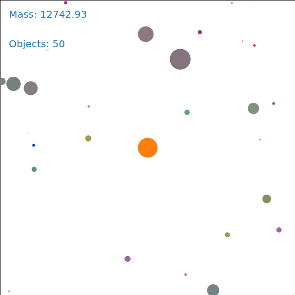
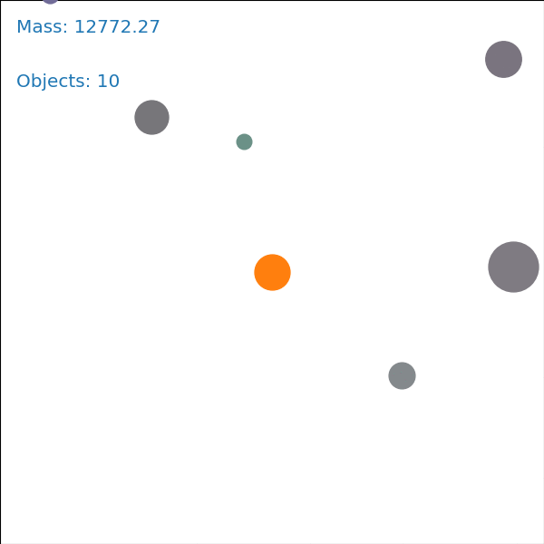

# planets
Ever wonder how Solar Systems were formed ?

In this simulation, every solar system starts with plenty of objects with random positions and random velocities.
At each timestep, every object's velocity is updated with respect to the gravitational attraction of the star.
Eventually, when two objects collide, they can either fuse or 'bounce' depending on their relative velocity.

This means that at some point objects will grow larger and larger, forming what we know as planets with stable orbits.

Try it yourself !

## Installation
To start using this package, you first install the dependencies:

    pip install -r requirements.txt

Alternatively, you can build and run a Docker container

    docker build -t planets .
    docker run -it planets

## Usage
Start creating solar system by simply running

    python main.py

  
   
  

