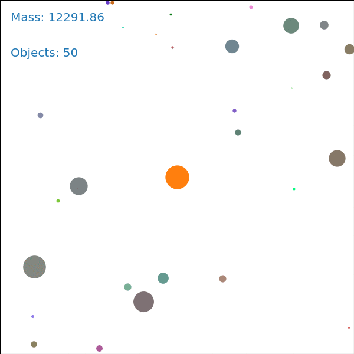

# planets

## Installation
To start using this package, you first install the dependencies
    pip install requirements.txt

Alternatively, you can build and run a Docker container
    docker build -t planets .
    docker run -it planets

## Usage
Start creating solar system by simply running
    python main.py

  
   
  

